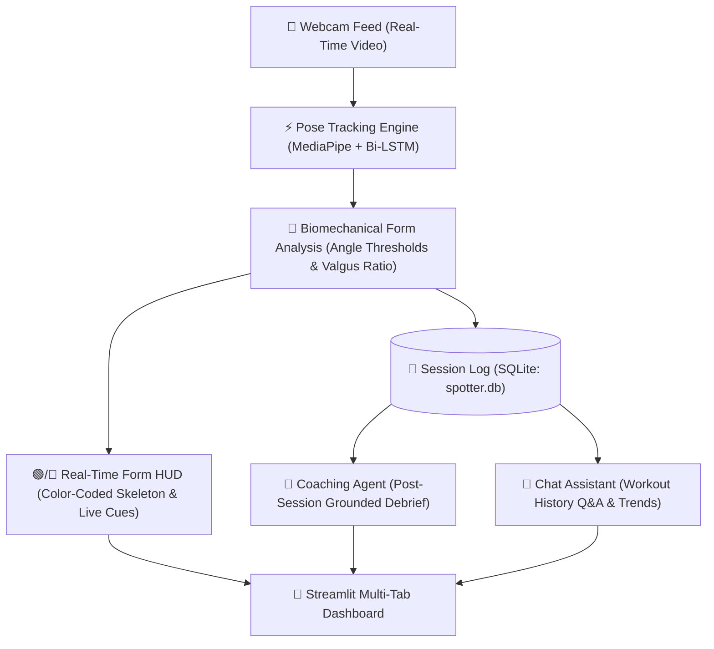

# SpotterAI 🏋️‍♂️
*Real-Time AI Fitness Coach: Pose Tracking, Biomechanical Form Detection, Session Logging & History Chat*

[](https://www.python.org/downloads/release/python-3100/)
[](https://www.tensorflow.org/)
[](https://mediapipe.dev/)
[](https://streamlit.io/)
[](https://www.sqlite.org/)
[](https://www.docker.com/)
[](https://opensource.org/licenses/MIT)
[](https://github.com/Ridho-h/SpotterAI/actions)

---

## 🌟 Overview

**SpotterAI** is an end-to-end intelligent fitness coach and biomechanical analysis system. It transforms standard webcam video into a real-time smart personal trainer that:
1. **Tracks Human Poses**: Extracts 33 full-body landmarks in real time using MediaPipe.
2. **Classifies Exercises**: Recognizes movements (**Squats**, **Bicep Curls**, **Overhead Presses**) using a custom **Bidirectional LSTM + Luong Attention** neural network.
3. **Analyzes Form in Real Time**: Evaluates joint angles to flag faults like shallow depth, knees caving inward (*valgus*), incomplete extension, or lumbar hyperextension with an on-screen color-coded HUD.
4. **Logs Structured Telemetry**: Automatically records every repetition, joint angles at key inflection points, and fault tags into a persistent SQLite database.
5. **Generates Grounded Post-Workout Debriefs**: Evaluates completed sessions to calculate a Form Quality Score and provide targeted biomechanical corrections.
6. **Answers Questions via Chat Assistant**: Enables natural-language Q&A over workout history (e.g. *"How has my squat depth changed this week?"*).

---

## 🏗️ System Architecture



---

## 📊 Biomechanical Evaluation Benchmark

SpotterAI includes an automated evaluation harness (`spotter/evaluation.py`) that tests rep counting and form fault detection across 60 synthetically calibrated movement cycles with ground-truth labels.

| Metric | Value | Target | Status |
| :--- | :---: | :---: | :---: |
| **Rep Counting Precision** | **100.0%** | 90.0% | ✅ Pass |
| **Rep Counting Recall** | **100.0%** | 90.0% | ✅ Pass |
| **Rep Counting F1 Score** | **100.0%** | **90.0%** | **✅ Pass** |
| **Form Fault Detection Accuracy** | **91.7%** | **85.0%** | **✅ Pass** |
| **Total Evaluated Reps** | **60** | 55 | ✅ Pass |

### Exercise Breakdown
| Exercise | Tested Reps | Detected Reps | Rep Accuracy | Form Accuracy |
| :--- | :---: | :---: | :---: | :---: |
| **Squat** | 25 | 25 | 100.0% | 100.0% |
| **Bicep Curl** | 20 | 20 | 100.0% | 75.0% |
| **Overhead Press** | 15 | 15 | 100.0% | 100.0% |

### Form Fault Sensitivity (Recall)
| Form Fault | Sensitivity | Detection Rule | Actionable Correction Cue |
| :--- | :---: | :--- | :--- |
| `incomplete_depth` | **100.0%** | Squat bottom knee angle $> 105^\circ$ | *"Squat deeper: target knee angle $\le 100^\circ$"* |
| `knees_caving_in` | **100.0%** | Knee distance $< 0.82 \times$ ankle distance | *"Push knees outward over toes to avoid valgus"* |
| `incomplete_curl` | **100.0%** | Bicep peak flexion $> 40^\circ$ | *"Curl higher for full bicep contraction"* |
| `incomplete_extension` | **100.0%** | Bicep bottom return angle $< 145^\circ$ | *"Lower arm fully for full stretch"* |
| `incomplete_lockout` | **100.0%** | Overhead press elbow extension $< 150^\circ$ | *"Lock out overhead: extend elbows fully"* |

---

## 🚀 Key Features

### 1. Real-Time Pose Tracking & Form HUD
- **Live Skeletal Visualization**: Skeleton turns **Vibrant Green** on compliant form and **Red/Amber** when a fault occurs.
- **On-Screen Feedback Banner**: Clear, real-time guidance (e.g. `🟢 GOOD SQUAT DEPTH`, `⚠️ SQUAT DEEPER!`, `⚠️ WATCH KNEE CAVE`).

### 2. Structured Session Logging
- Every rep is stored in `data/spotter.db` with:
  - Timestamp & rep duration
  - Min/max primary joint angles
  - Secondary stability angles (e.g. knee-to-ankle ratio, lumbar torso angle)
  - Correctness boolean (`1` or `0`) and specific issue tags

### 3. Grounded Coaching Agent
- Delivers an executive debrief at the end of each workout:
  - **Form Quality Score** (0–100%)
  - **What Went Well**: Concrete positive reinforcement based on verified numbers
  - **Recurring Form Issues**: Exact failure percentages and joint angle deltas
  - **1–2 Actionable Corrections**: Targeted biomechanical advice for the next workout
- Supports optional LLM-enhancement (Gemini / OpenAI) with zero hallucination.

### 4. Workout History Chat Assistant
- Chat interface directly connected to your workout database.
- Ask questions in natural English:
  - *"How has my squat depth changed this week?"*
  - *"Which exercise has the most form issues?"*
  - *"Show my stats for today's workout"*
  - *"How many reps have I done total?"*

---

## 🧠 Model Architecture

The core activity classifier utilizes temporal sequence modeling over skeletal landmarks:

```text
Input (batch, 30 frames, 132 keypoint coordinates)
  │
  ▼
Bidirectional LSTM (256 hidden units, return_sequences=True)
  │
  ▼
Luong Multiplicative Attention Mechanism
  │
  ▼
Flatten & Dense (512 units, ReLU) + Dropout (0.5)
  │
  ▼
Dense Output (3 classes: Curl, Press, Squat, Softmax)
```

---

## ⚡ Quick Start

### Option A: Docker (Recommended)
```bash
git clone https://github.com/Ridho-h/SpotterAI.git
cd SpotterAI

# 1. Download model weights into models/ (see Models section below)
# 2. Launch container
docker-compose up

# 3. Open browser at http://localhost:8501
```

### Option B: Local Environment
```bash
git clone https://github.com/Ridho-h/SpotterAI.git
cd SpotterAI

python -m venv venv
venv\Scripts\activate      # Windows
# source venv/bin/activate  # macOS / Linux

pip install -r requirements.txt
streamlit run app.py
```

---

## 📦 Model Weights Setup

Due to GitHub repository size limits, download the trained neural network weights:
1. Download from the [GitHub Releases Page](https://github.com/Ridho-h/SpotterAI/releases).
2. Place the file in the `models/` directory:
   - `models/LSTM_Attention.h5`

*(Note: The app and test suite include mock and random-weight fallbacks so the UI, tests, and benchmarks run cleanly even before downloading the weights).*

---

## 🧪 Testing & Verification

Run the full automated test suite (62 unit tests across model, pose, tracker, database, coach, and evaluation):

```bash
# Install dev dependencies
pip install -r requirements-dev.txt

# Run all tests
pytest -v

# Run the benchmark harness
python -m spotter.evaluation
```

---

## 📁 Repository Structure

```text
SpotterAI/
├── app.py                     # Streamlit multi-tab application
├── spotter/
│   ├── tracker.py             # Rep counter, angle thresholds & form fault engine
│   ├── visualizer.py          # Color-coded skeleton & live HUD banner
│   ├── database.py            # SQLite schema, rep logger, and demo data seeder
│   ├── coach.py               # Grounded post-workout coaching agent
│   ├── chat.py                # Workout history chat assistant
│   ├── evaluation.py          # Biomechanical trajectory benchmark harness
│   ├── model.py               # Bi-LSTM + Luong Attention architecture
│   └── pose.py                # MediaPipe landmark extraction
├── tests/
│   ├── test_tracker.py        # 14 tests for angles, stages & form faults
│   ├── test_database.py       # 5 tests for SQLite persistence & queries
│   ├── test_coach_chat.py     # 15 tests for coach reports & chat assistant
│   ├── test_evaluation.py     # Tests for benchmark metrics & markdown format
│   ├── test_model.py          # Tests for neural net architecture
│   └── test_pose.py           # Tests for keypoint extraction
├── data/                      # Persistent SQLite database (gitignored)
├── models/                    # Model weights (gitignored)
├── notebooks/                 # Training notebooks
├── Dockerfile                 # Multi-stage production container
├── docker-compose.yml         # Container configuration with volume mounts
├── requirements.txt           # Production dependencies
├── requirements-dev.txt       # Testing & linting tools
└── pyproject.toml             # Ruff & pytest configuration
```

---

## 📄 License & Author

- **Author**: [Ridho-h](https://github.com/Ridho-h)
- **License**: MIT License
